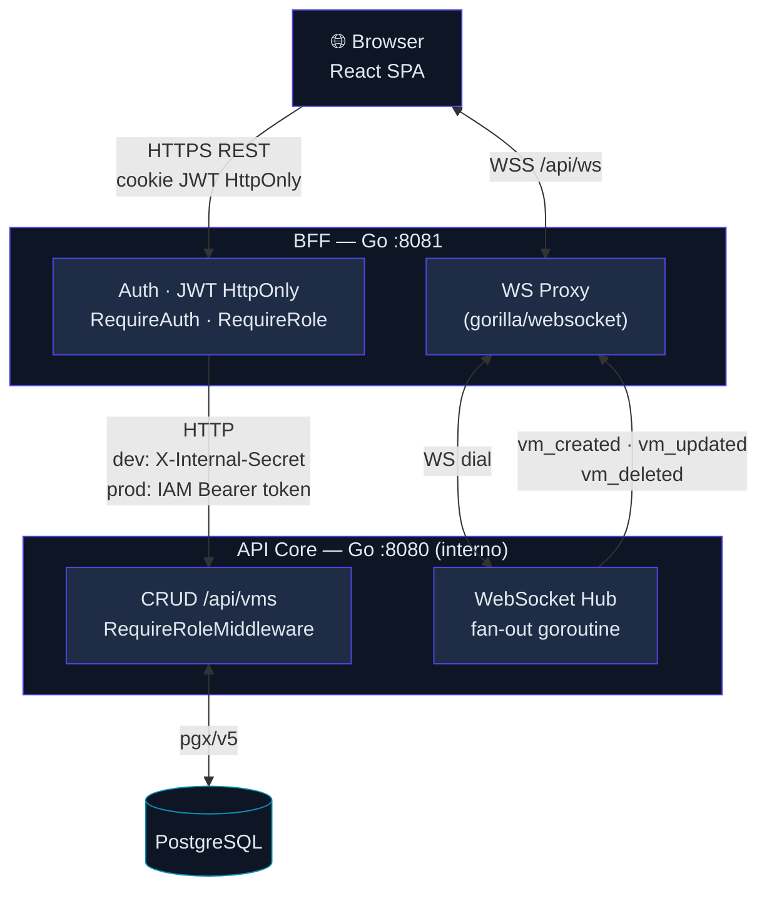

# VM Dashboard — Prueba Técnica Full Stack (IFX Networks)

SPA para gestión de máquinas virtuales con API RESTful de soporte, autenticación
segura (JWT en cookie HttpOnly), RBAC por rol y actualización en tiempo real vía WebSockets.

## Stack

- **Frontend:** React + Vite + TypeScript, React Query, Zustand, Tailwind + shadcn/ui, Recharts
- **BFF:** Go — autenticación, sesión, proxy hacia API Core
- **API Core:** Go — CRUD de VMs, hub de WebSockets
- **DB:** PostgreSQL
- **Infra:** GCP (Cloud Run x3, Cloud SQL, Secret Manager, IAM service-to-service)

Ver `SDD-VM-Dashboard.md` y `Decisiones-Tecnicas.md` para el detalle de arquitectura y justificación de cada elección.

---

## Guía de despliegue local (desde cero)

### Requisitos previos
- Docker + Docker Compose
- Node.js 20+ (solo si quieres correr el frontend fuera de Docker en modo dev)
- Go 1.22+ (solo si quieres correr el backend fuera de Docker en modo dev)

### Pasos

```bash
# 1. Clonar el repositorio
git clone <URL_REPO>
cd vm-dashboard

# 2. Levantar todo el stack (frontend, bff, api-core, postgres)
#    El seed de usuarios y VMs de prueba se aplica automáticamente al primer arranque.
docker compose up --build

# 3. Abrir la aplicación
# Frontend: http://localhost:3001   ← nginx SPA + proxy /api → BFF
# BFF:      http://localhost:8081   (accesible directamente para debug de API)
# API Core: interno — solo accesible desde la red Docker (bff → api-core:8080)
```

> ⚠️ **Conflicto de puertos**
>
> El frontend de Docker usa el puerto **3001**. Si tienes el servidor de desarrollo de Vite
> corriendo (`npm run dev`, que usa **5173/5176**), ambos pueden coexistir. El Vite dev
> server proxea a `localhost:8081` directamente — no pasa por nginx. Para el stack completo
> en Docker abre `http://localhost:3001`.

### Detener y limpiar

```bash
docker-compose down -v
```

---

## Credenciales de prueba

| Rol | Email | Password |
|---|---|---|
| Administrador | `admin@vm.dev` | `admin123` |
| Cliente | `cliente@vm.dev` | `admin123` |

> Definidas en `backend/api-core/migrations/seed.sql`. Solo para entorno local — no usar en producción.

---

## Despliegue en GCP

Arquitectura BFF con API Core privada (invocación IAM service-to-service). Detalle completo
en `SDD-VM-Dashboard.md` §8.

### Variables de entorno requeridas en Cloud Run

| Variable | Servicio | Valor en prod |
|---|---|---|
| `JWT_SECRET` | bff | Secret Manager → `jwt-signing-key` |
| `INTERNAL_PROXY_SECRET` | — | No aplica en prod (reemplazado por IAM) |
| `DATABASE_URL` | bff, api-core | Secret Manager → `db-credentials` |
| `API_CORE_URL` | bff | URL del servicio Cloud Run `api-core` |
| `APP_ENV` | bff, api-core | `prod` |

### Pasos de despliegue

```bash
# 1. Autenticarse y configurar el proyecto
gcloud auth login
gcloud config set project ifx-vm-dashboard

# 2. Habilitar APIs necesarias
gcloud services enable run.googleapis.com secretmanager.googleapis.com \
  sqladmin.googleapis.com artifactregistry.googleapis.com

# 3. Crear service account del BFF
gcloud iam service-accounts create bff-invoker \
  --display-name="BFF → API Core invoker"

# 4. Desplegar api-core (privado — sin acceso público)
gcloud run deploy api-core \
  --source ./backend/api-core \
  --region us-central1 \
  --no-allow-unauthenticated \
  --set-env-vars APP_ENV=prod \
  --set-secrets DATABASE_URL=db-credentials:latest

# 5. Otorgar al BFF permiso para invocar api-core
#    Reemplazar PROJECT_ID con el ID real del proyecto GCP.
#    Ejecutar DESPUÉS de que api-core esté desplegado.
gcloud run services add-iam-policy-binding api-core \
  --region us-central1 \
  --member="serviceAccount:bff-invoker@PROJECT_ID.iam.gserviceaccount.com" \
  --role="roles/run.invoker"

# 6. Desplegar BFF (público)
gcloud run deploy bff \
  --source ./backend/bff \
  --region us-central1 \
  --allow-unauthenticated \
  --service-account="bff-invoker@PROJECT_ID.iam.gserviceaccount.com" \
  --set-env-vars APP_ENV=prod \
  --set-env-vars API_CORE_URL=$(gcloud run services describe api-core --region us-central1 --format 'value(status.url)') \
  --set-secrets JWT_SECRET=jwt-signing-key:latest \
  --set-secrets DATABASE_URL=db-credentials:latest

# 7. Desplegar frontend (público)
gcloud run deploy frontend \
  --source ./frontend \
  --region us-central1 \
  --allow-unauthenticated
```

> **Nota:** `api-core` tiene `--no-allow-unauthenticated`. Solo la service account
> `bff-invoker` puede invocarlo (binding del paso 5). El BFF obtiene un ID Token
> del metadata server de GCP y lo envía como `Authorization: Bearer <token>`.
> La plataforma Cloud Run valida el token antes de que llegue al container —
> `INTERNAL_PROXY_SECRET` no se usa en producción.

URL de la app desplegada: `<pendiente>`

---

## Arquitectura



**Notas de seguridad:**
- `api-core` no tiene `ports:` en docker-compose — solo accesible desde la red Docker interna
- En prod, `X-Internal-Secret` es reemplazado por IAM service-to-service (Cloud Run → OIDC)
- JWT nunca sale del servidor: cookie `HttpOnly; SameSite=Strict; Secure` (prod)

---

## Documentación técnica

- **Decisiones arquitectónicas**: `Decisiones-Tecnicas.md` (justificación de stack, Optimistic UI, BFF pattern)
- **Registro de desarrollo**: `BITACORA.md` (decisiones en vivo, bugs encontrados, hallazgos de seguridad)

---

## Bitácora de uso de IA

**Herramienta:** Claude Code (claude-sonnet-4-6) — CLI interactivo con acceso a herramientas de lectura/escritura de archivos, ejecución de comandos, y Bash.  
**Sesiones:** múltiples conversaciones con compresión de contexto entre ellas; registro completo en `files/BITACORA.md`.

### Tabla de módulos

| Módulo | Delegado a IA | Intervención humana |
|---|---|---|
| 1 — Auth backend (Go) | Hash bcrypt, JWT, rutas de login/logout, migrations | Detectó que el hash de `admin123` en seed.sql no matcheaba — verificado con `bcrypt.CompareHashAndPassword` y corregido |
| 2 — CRUD VMs | CRUD completo (handler, service, repo, tests) | Validación del esquema de DB y regex de nombre de VM |
| 3 — BFF JWT + cookie HttpOnly | JWT service, cookie auth, proxy con `X-Internal-Secret` | **Detectó el bypass de seguridad** (ver prompt clave 1) antes de que se escribiera código inseguro |
| 4 — Middleware roles + IAM | `RequireRole` en BFF y `RequireRoleMiddleware` en api-core, 17 tests | Exigió el test de "X-User-Role ausente → 403" como el más crítico; pidió justificación documentada del status code (403 vs 401) |
| 5 — Optimistic UI | Mutaciones optimistas con rollback, `useCreateVM`, `useDeleteVM` | Diseñó la estrategia de colisión WS↔Optimistic (3 casos distintos según tipo de evento) |
| 6 — Dashboard (charts) | `ResourcesPanel` con Recharts, `VMCardSkeleton`, `DashboardLayout` | Aprobación de proporciones del gráfico y layout |
| 7 — WebSockets | Hub goroutine, handler, proxy BFF, `useVMWebSocket`, tests de auth | Corrigió 3 detalles: `vm_created`/`vm_deleted` en hub, guard `isFirstConnect`, tests WS auth al mismo nivel de rigor que tests HTTP |
| 8 — Dark mode | Tokens CSS, `DarkModeSync`, localStorage, `toggleDarkMode` | Exigió verificación WCAG con algoritmo real (no cálculo manual); detectó error en cálculo previo; 4 pares de contraste corregidos |
| Dockerfiles + Compose | Multi-stage builds, healthchecks, seed automático vía `initdb.d` | Detectó conflicto de puertos (Juice Shop en 3000, Burp Suite en 8080, Vite en 5173) |
| Auth bug post-integración | — | **Detectó que login "no hacía nada"** (ver prompt clave 2); llevó al descubrimiento del contrato de tipos mentido en `getMe()`/`login()`; resultó en 7 tests de regresión que mockean `fetch` directamente |

### Prompts clave

**1 — Bypass de `X-Internal-Secret` detectado antes de escribir código (Módulo 3)**

> *"X-User-Id en api-core lo puede poner cualquiera — no hay nada que verifique que la petición viene del BFF. Alguien que conozca el puerto interno puede enviar X-User-Id: admin-uuid sin JWT. Añadir INTERNAL_PROXY_SECRET como secreto compartido; api-core valida X-Internal-Secret antes de leer X-User-Id; api-core sin ports en docker-compose — solo accesible desde la red Docker interna."*

La revisión ocurrió sobre el **plan escrito**, antes de generar código. Resultado: cero líneas de código inseguras. La corrección incluyó `log.Fatal` si `INTERNAL_PROXY_SECRET` está vacío al arrancar, y la rama `APP_ENV=prod` que sustituye el secreto compartido por IAM Bearer token (Cloud Run OIDC).

**2 — Bug `getMe()`/`login()`: contrato de tipos mentido, encontrado con verificación manual**

> *"a mi no me funciona con ese usuario y password de hecho no dice nada se queda ahí"*

El login ejecutaba `navigate('/dashboard')` exitosamente, pero `ProtectedRoute` rebotaba de vuelta a `/login` en milisegundos — invisible para el usuario. Causa: `login()` devolvía `{"ok":"true"}` (tipado como `Promise<{ user: AuthUser }>`) y `getMe()` devolvía `AuthUser` directo (también tipado como `Promise<{ user: AuthUser }>`). Ambas firmas mentían sobre su runtime. Los tests de `LoginPage` no lo detectaron porque mockeaban `login` completo devolviendo la forma correcta — el mock eliminaba la verificación real. Fix: `login()` encadena `getMe()` tras el POST; `getMe()` wrappea la respuesta en `{ user }`. Se añadieron 7 tests que mockean `fetch` (no la función) — la única forma de atrapar este contrato en el límite entre cliente y red.

### Lección central

El patrón que aparece en ambos prompts clave — y en el error de TypeScript del formatter de Recharts encontrado durante `docker compose up --build` — es el mismo: **una capa elimina la verificación real** (mock que devuelve la forma correcta / esbuild que ignora tipos / plan sin adversario que prueba el flujo). La detección siempre llegó desde fuera de esa capa: revisión del plan antes de codear, prueba manual del usuario, build de producción en lugar del dev server. La lección no es "pedir más tests" sino "identificar qué capa está eliminando la verificación y crear un observable externo a esa capa".
